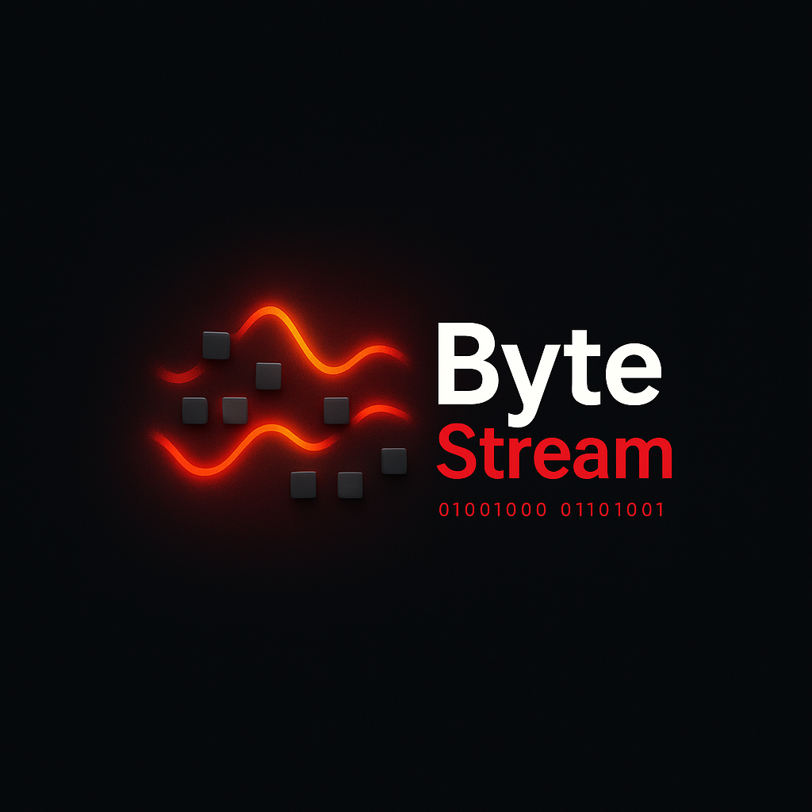

<h1 align="center">
  <br>
  
  <br>
  ByteStream Desktop
  <br>
  <br>
</h1>

<h4 align="center">The ultimate movie streaming torrent app with real-time web scraping. For Mac, Windows, and Linux.</h4>

<p align="center">
  <a href="https://github.com/webtorrent/webtorrent-desktop/releases"></a>
  <a href="https://github.com/webtorrent/webtorrent-desktop/releases"></a>
  <a href="https://standardjs.com"></a>
</p>

## Features

- 🎬 **Real-time Movie Streaming** - Browse and stream thousands of movies scraped live from the web
- 🔍 **Smart Search** - Search movies by title, genre, or year with pagination support
- 📂 **Category Browsing** - Explore movies by categories: Action, Comedy, Drama, Horror, and more
- 🎯 **Beautiful UI** - Modern Apple-inspired interface with smooth animations and dark theme
- 📥 **Torrent Downloads** - Download movies via magnet links with full torrent client capabilities
- 🌐 **Integrated Backend** - Built-in Python backend for real-time web scraping (no external server needed)
- 🎥 **Built-in Media Player** - Watch movies directly in the app with subtitle support
- 💾 **Download Management** - Track and manage all your downloads in one place

## Install

### Download Pre-built Application

Download the latest version of ByteStream Desktop from the [GitHub releases](https://github.com/webtorrent/webtorrent-desktop/releases) page:

- **macOS**: `ByteStream-darwin-x64.zip`
- **Windows**: `ByteStream-win32-x64.zip`
- **Linux**: `ByteStream-linux-x64.zip`

### Run from Source

#### Prerequisites

- Node.js (v16 or higher)
- Python 3.x
- npm or yarn

#### Get the code

```bash
$ git clone https://github.com/webtorrent/webtorrent-desktop.git
$ cd webtorrent-desktop
$ npm install
```

#### Install Python dependencies

```bash
$ pip install flask flask-cors requests beautifulsoup4
```

#### Run the app

```bash
$ npm start
```

The app will automatically start the backend server on port 8080.

## Building from Source

### Build Standalone Application

#### Option 1: Package with Python Script (Requires Python on end-user machine)

```bash
$ npm run package-with-backend
```

#### Option 2: Create Standalone Executable (No Python required)

First, create the standalone backend:

```bash
$ pip install pyinstaller
$ npm run build-backend
```

Then package the app:

```bash
$ npm run package
```

### Platform-specific builds

```bash
$ npm run package -- [platform]
```

Where `[platform]` is `darwin`, `linux`, `win32`, or `all` (default).

## Architecture

ByteStream consists of two main components:

### 1. Frontend (Electron + React)
- Built with Electron for cross-platform desktop support
- React-based UI with Material Design components
- Real-time torrent streaming using WebTorrent
- Modern movie browsing interface

### 2. Backend (Python Flask)
- Real-time web scraping from piaohua.com
- RESTful API for movie data
- No database required - all data fetched on-demand
- Endpoints:
  - `/api/home` - Homepage movies with categories
  - `/api/category/<name>` - Movies by category with pagination
  - `/api/search` - Search movies
  - `/api/movie/<id>` - Detailed movie information

## Development

### Watch the code

Restart the app automatically every time code changes:

```bash
$ npm run watch
```

### Run linters

```bash
$ npm test
```

### Backend Development

The Python backend is located in `backend/app_online.py`. To run it separately:

```bash
$ cd backend
$ python app_online.py
```

The backend runs on `http://localhost:8080` by default.

## Project Structure

```
bytestream-desktop/
├── src/
│   ├── main/           # Electron main process
│   ├── renderer/       # React UI components
│   │   ├── components/ # Reusable components
│   │   ├── pages/      # Page components
│   │   └── lib/        # Utilities and helpers
│   └── config.js       # App configuration
├── backend/
│   └── app_online.py   # Python backend server
├── static/             # Static assets (icons, styles)
├── build/              # Compiled JavaScript
└── dist/               # Packaged applications
```

## Key Components

### Movie Browsing
- **Home Page**: Featured movies carousel and categorized sections
- **Category Page**: Browse movies by genre with tab navigation
- **Search Page**: Real-time search with pagination
- **Movie Modal**: Detailed view with download options

### Download Management
- Add movies to download queue
- Track download progress
- Manage active torrents
- Built-in media player for completed downloads

## Configuration

The app stores configuration in:
- **macOS**: `~/Library/Application Support/ByteStream`
- **Windows**: `%APPDATA%/ByteStream`
- **Linux**: `~/.config/ByteStream`

Downloaded files are saved to:
- Default: User's Downloads folder
- Configurable in app preferences

## Troubleshooting

### Backend fails to start
- Ensure Python 3.x is installed
- Check if port 8080 is available
- Verify Python dependencies are installed

### Movies don't load
- Check internet connection
- Verify backend is running (check console for errors)
- Ensure firewall isn't blocking the app

### Build issues
- Clear `node_modules` and reinstall: `rm -rf node_modules && npm install`
- Clear build directories: `rm -rf build dist`
- For Windows builds on macOS, install Wine: `brew install --cask wine-stable`

## License

MIT. Copyright (c) [ByteStream, LLC](https://github.com/webtorrent/webtorrent-desktop).